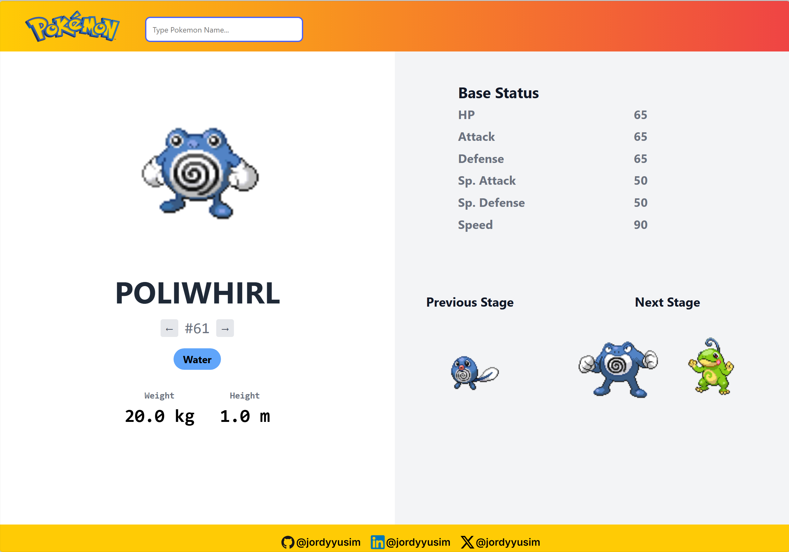
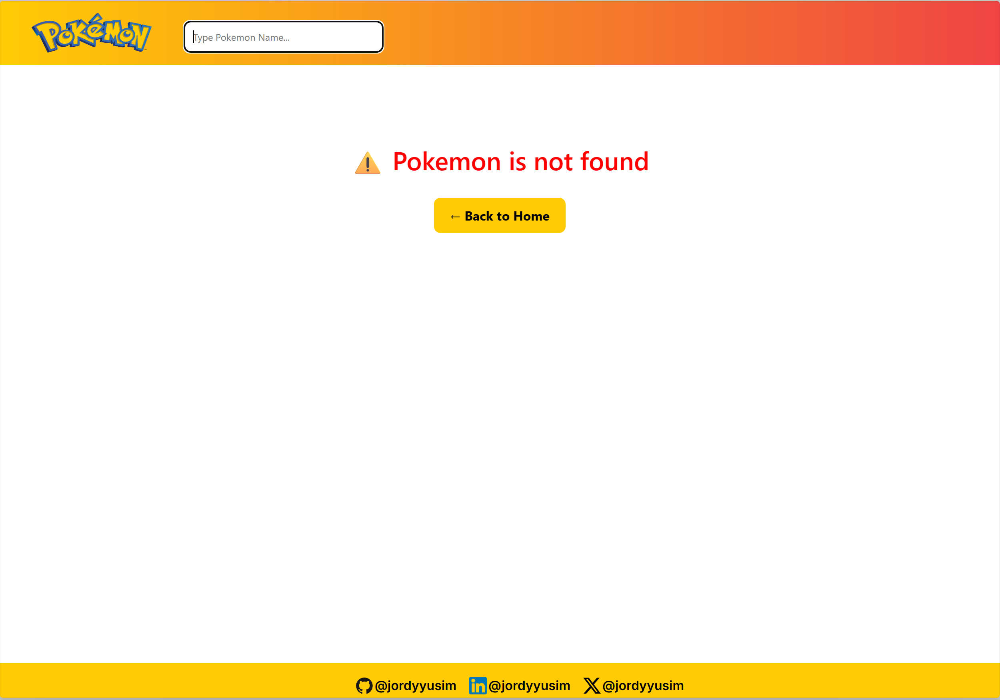

# 🔍 Pokemon Database Website

A web-based Pokemon Database built with **Django** and integrated with the public **PokeAPI**. You can search for any Pokémon, view its base stats, type(s), height/weight, and evolution stages — all in a sleek.

---

## 🌟 Features

- 🔍 Search for Pokémon by name
- 🔄 Navigate pokemon after/before by arrow buttons
- 📊 Display a dynamic type badges and detailed base stats (HP, Attack, Defense, etc.)
- 🧬 Evolution chain: previous and next stages with images
- 🎨 Responsive design with Bootstrap and custom styling
- ⚠️ Error handling for invalid or unknown Pokémon

---

## 🛠️ Built With

- Python
- Django
- HTML/CSS
- PokéAPI (https://pokeapi.co)

---

## 📸 Screenshots





---

## 📦 Installation

1. **Clone the repository**:

    ```bash
    git clone https://github.com/jordyyusim/pokemon-database-website.git
    cd pokemon-database-website
    ```

2. **Create a virtual environment**:

    ```bash
    python -m venv yourenv
    source yourenv/bin/activate      # On Windows: yourenv\Scripts\activate
    ```

3. **Install the dependencies**:

    ```bash
    pip install -r requirements.txt
    ```

4. **Run the development server**:

    ```bash
    python manage.py runserver
    ```

5.  **Run the app**:
    ```bash
    Open [`http://127.0.0.1:8000/`](http://127.0.0.1:8000/) in your browser
    ```
---

## 📬 Socials

[GitHub](https://github.com/jordyyusim) &nbsp;|&nbsp;
[LinkedIn](https://linkedin.com/in/jordyyusim) &nbsp;|&nbsp;
[X](https://x.com/jordyyusim)

